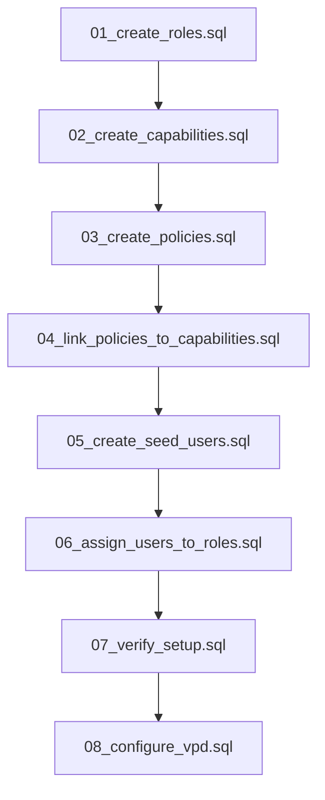

# Onboarding Setup Guide

Follow these steps to stand up the auth service locally or in a fresh environment. Deeper troubleshooting and SQL explanations live in the RBAC and VPD folders.

## Before You Start

- PostgreSQL 13+ available and reachable from your shell.
- `psql` installed and able to authenticate as an admin user.
- The repository cloned with the `docs/ONBOARDING/setup/` scripts intact.

Quick connectivity check:

```bash
psql -U postgres -d postgres -c "SELECT version();"
createdb -U postgres auth_service_db 2>/dev/null || true
```

## What The Bootstrap Creates

| Asset | Description |
| --- | --- |
| Roles | 7 roles required by production (bootstrap through test user) |
| Capabilities | 98 fine-grained actions |
| Policies | 7 policy bundles, one per role |
| Mappings | Endpoint, capability, and policy relationships |
| Seed users | One sample account per role for verification |
| VPD helpers | Functions and policies enabling row-level security |

## Script Execution Order



Run everything from the repo root (or adjust paths accordingly):

```bash
for script in {01..08}_*.sql; do
  psql -U postgres -d auth_service_db -f docs/ONBOARDING/setup/$script
done
```

> Need a one-shot helper? Use `docs/ONBOARDING/setup/01_complete_onboarding.sql` when it is available for your environment.

## Validate The Result

1. Execute `docs/ONBOARDING/setup/07_verify_setup.sql`.
2. Run the SQL queries listed in `../RBAC/testing.md` to confirm role/capability wiring.
3. Switch to non-superuser roles and run the RLS checks found in `../VPD/testing/`.
4. Call `/api/me/authorizations` for each seeded user and verify the expected capabilities appear.

## Common Recovery Steps

- Missing roles or users → rerun scripts 01–06.
- Capabilities out of sync → rerun 02–04 and double-check the definitions in `../RBAC/DEFINITIONS/PHASE3_CAPABILITIES_DEFINITION.md`.
- RLS returning empty sets → ensure `08_configure_vpd.sql` executed and the ACL table is populated (`../VPD/README.md`).

## After Bootstrap

1. Rotate or disable the `PLATFORM_BOOTSTRAP` account.
2. Configure the auth service `application.yml` with the database and JWT secrets you just used.
3. Commit any environment-specific overrides to your deployment manifests rather than these docs.
