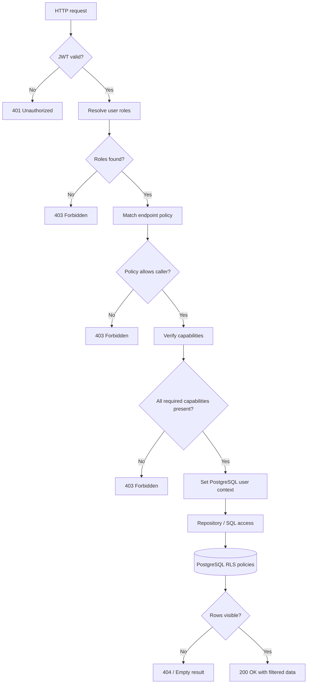
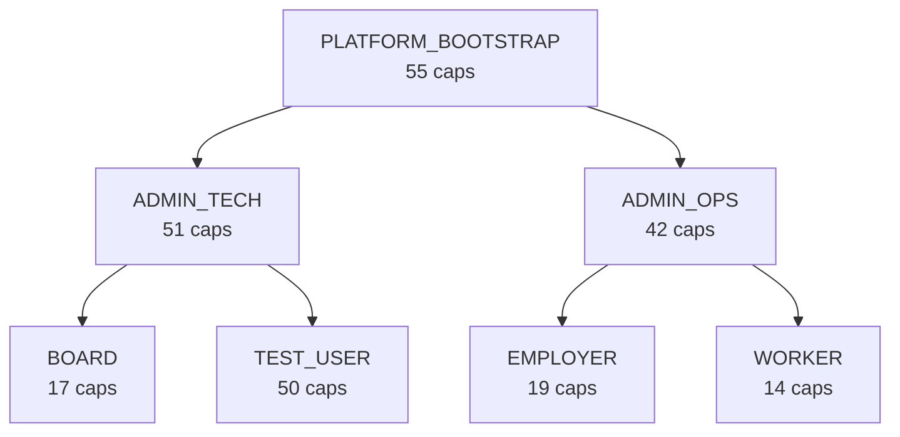

# RBAC Architecture

This note shows how a request flows through the auth service and where each enforcement decision happens. Pair it with `../VPD/README.md` for the row-level security specifics.

## Request Pipeline

## Enforcement Layers

| Layer | Responsibility | Source of Truth |
| --- | --- | --- |
| Endpoint policy | Routes mapped to policies per HTTP verb | `auth.endpoint_policy` (see `MAPPINGS/PHASE5_ENDPOINT_POLICY_MAPPINGS.md`) |
| Capability set | Fine-grained actions linked to policies | `auth.policy_capability`, definitions in `DEFINITIONS/PHASE3_CAPABILITIES_DEFINITION.md` |
| Data isolation | Tenant scope enforced by PostgreSQL | `auth.user_tenant_acl` and RLS functions in `../VPD/README.md` |

## Role Hierarchy At A Glance

The counts summarise active capabilities per role; authoritative details remain in `ROLES.md`.

## Capability Model

- Capabilities use the `<domain>.<subject>.<action>` pattern, for example `payment.record.create`.
- Policies package capabilities for a role; they also drive the `@PreAuthorize` expressions in Spring Security.
- Additions or renames happen in `DEFINITIONS/PHASE3_CAPABILITIES_DEFINITION.md` and must be reflected in the SQL seeds.

## Integration Touchpoints

- **Spring Security filters** handle JWT verification and populate the security context.
- **Policy service** resolves endpoint policies and required capabilities before controller execution.
- **`RLSContextFilter`** issues `auth.set_user_context(<user_id>)` so PostgreSQL can enforce tenant ACLs.
- **Audit logging** records every 401/403 with the policy and capability identifiers that caused the denial.
