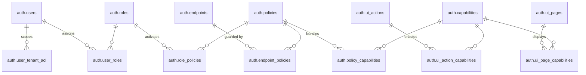

# Data Map & Relationships

**Navigation:** Previous: [Architecture Overview](overview.md) → Next: [Journey: Login To Data](../guides/login-to-data.md)

This guide maps the PostgreSQL tables that power authentication and authorization. Use it when you need to understand how roles, policies, capabilities, and tenant scopes join together.

## Core Entities



## Entity Descriptions

### 🔐 **auth.users** - Core User Records
Stores human users and service accounts. Every login, API call, and permission check starts here.

| Column | Type | Purpose |
| --- | --- | --- |
| `id` | UUID | Primary key |
| `username` | TEXT | Unique login identifier |
| `email` | TEXT | Contact information |
| `status` | ENUM | ACTIVE, DISABLED, LOCKED |
| `is_service_account` | BOOLEAN | Flag for service accounts (token-only) |
| `created_at` | TIMESTAMP | Audit trail |

**Examples:**
- `worker.demo` (human user, WORKER role)
- `employer.acme` (human user, EMPLOYER role)
- `payment-sync-bot` (service account, automation)

---

### 👤 **auth.roles** - Responsibility Badges
Groups users by job function. Think of roles as "responsibility badges" that multiple people wear.

| Column | Type | Purpose |
| --- | --- | --- |
| `id` | UUID | Primary key |
| `name` | TEXT | Role name (e.g., WORKER, EMPLOYER, ADMIN) |
| `description` | TEXT | Purpose and scope |
| `is_active` | BOOLEAN | Enable/disable entire role |

**Examples:**
- WORKER - Employees submitting payment docs
- EMPLOYER - Managers reviewing submissions
- BOARD - C-suite approval authority
- PLATFORM_ADMIN - System maintenance

**Typical Count:** 5-10 roles per organization

---

### 📋 **auth.policies** - Rulebooks
Bundles of capabilities tied to roles. A policy says "if you have this role, you can do these things."

| Column | Type | Purpose |
| --- | --- | --- |
| `id` | UUID | Primary key |
| `name` | TEXT | Policy name (e.g., WORKER_POLICY) |
| `description` | TEXT | Intent and scope |
| `is_active` | BOOLEAN | Enable/disable entire policy |

**Example:**
- WORKER_POLICY bundles: { payment.details.read, payment.submit, payment.track }

---

### 💡 **auth.capabilities** - Atomic Permissions
Smallest unit of permission (e.g., "read payments" or "download ledger"). Named as `<domain>.<subject>.<action>`.

| Column | Type | Purpose |
| --- | --- | --- |
| `id` | UUID | Primary key |
| `name` | TEXT | Unique identifier (e.g., payment.ledger.download) |
| `description` | TEXT | Human-readable purpose |
| `domain` | TEXT | Category (payment, worker, admin) |
| `is_active` | BOOLEAN | Enable/disable capability |

**Examples:**
- `payment.ledger.download` - Download employer payment history
- `payment.details.read` - View payment record content
- `worker.manage` - Create/update worker profiles
- `user.manage` - Assign roles to users

**Typical Count:** 50-100+ capabilities per organization

---

### 🔗 **auth.endpoints** - HTTP Guards
Every API endpoint that needs protection is registered here. Defines method + path + requirements.

| Column | Type | Purpose |
| --- | --- | --- |
| `id` | UUID | Primary key |
| `method` | ENUM | GET, POST, PUT, DELETE, PATCH |
| `path` | TEXT | Route pattern (e.g., /api/admin/capabilities) |
| `label` | TEXT | Human description |
| `is_public` | BOOLEAN | No auth required? |
| `created_at` | TIMESTAMP | Audit |

**Examples:**
- GET `/api/payment-requests` → requires payment.details.read
- POST `/api/admin/users` → requires user.manage
- GET `/health` → public, no auth

---

### 🔐 **auth.ui_pages** - Front-End Surfaces
Pages/sections in the UI. Linked to capabilities so the UI can show/hide sections.

| Column | Type | Purpose |
| --- | --- | --- |
| `id` | UUID | Primary key |
| `code` | TEXT | Identifier (e.g., EMPLOYER_DASHBOARD) |
| `label` | TEXT | Display name |
| `description` | TEXT | Purpose |
| `route` | TEXT | URL path |
| `is_active` | BOOLEAN | Show in navigation? |

**Examples:**
- EMPLOYER_DASHBOARD → /dashboard/employer (requires capability payment.view)
- ADMIN_PANEL → /admin (requires capability admin.access)

---

### 🔘 **auth.ui_actions** - Interactive Elements
Buttons, links, menu items in the UI. Linked to capabilities for conditional rendering.

| Column | Type | Purpose |
| --- | --- | --- |
| `id` | UUID | Primary key |
| `code` | TEXT | Component ID (e.g., BTN_DOWNLOAD_LEDGER) |
| `label` | TEXT | Button text |
| `description` | TEXT | Tooltip/help text |
| `is_active` | BOOLEAN | Show by default? |

**Examples:**
- BTN_DOWNLOAD_LEDGER → "Download" button (requires payment.ledger.download)
- BTN_EXPORT_CSV → "Export" button (requires payment.export)

---

### 🌐 **auth.user_tenant_acl** - Data Scope Limiter
Defines which organizations/employers a user can access. Powers Row-Level Security (RLS).

| Column | Type | Purpose |
| --- | --- | --- |
| `user_id` | UUID | Foreign key to auth.users |
| `employer_id` | UUID | Organization the user belongs to |
| `board_id` | UUID | (Optional) Board the user serves |
| `scope_type` | ENUM | ORGANIZATION, BOARD, DIVISION |
| `created_at` | TIMESTAMP | Audit |

**Example:**
- worker.demo can only see data from employer_id=5 (ACME Inc)
- employer.acme can see all workers in employer_id=5
- board.member can see reports across multiple employers

---

## Junction Tables (Relationships)

### **auth.user_roles** - User ↔ Role Assignment
Who has which role (many-to-many).

```
user.demo → [user_roles] → WORKER role
user.demo → [user_roles] → TEST_USER role
```

---

### **auth.role_policies** - Role ↔ Policy Activation
Which policies activate with each role.

```
WORKER role → [role_policies] → WORKER_POLICY
EMPLOYER role → [role_policies] → EMPLOYER_POLICY
```

---

### **auth.policy_capabilities** - Policy ↔ Capability Bundle
Which capabilities are inside each policy.

```
WORKER_POLICY → [policy_capabilities] → payment.details.read
WORKER_POLICY → [policy_capabilities] → payment.submit
```

---

### **auth.endpoint_policies** - Endpoint ↔ Policy Guard
Which policies protect which endpoints.

```
GET /api/payments/123 → [endpoint_policies] → WORKER_POLICY (requires it)
POST /api/admin/users → [endpoint_policies] → ADMIN_POLICY (requires it)
```

---

### **auth.ui_page_capabilities** & **auth.ui_action_capabilities**
Which capabilities unlock which UI elements.

```
DASHBOARD page → [ui_page_capabilities] → payment.view (show if user has it)
"Download" button → [ui_action_capabilities] → payment.export (enable if user has it)
```

---

## Read Paths (Common Queries)

### "What can user X do?"
```sql
SELECT DISTINCT c.name
FROM auth.users u
JOIN auth.user_roles ur ON u.id = ur.user_id
JOIN auth.roles r ON ur.role_id = r.id
JOIN auth.role_policies rp ON r.id = rp.role_id
JOIN auth.policies p ON rp.policy_id = p.id
JOIN auth.policy_capabilities pc ON p.id = pc.policy_id
JOIN auth.capabilities c ON pc.capability_id = c.id
WHERE u.id = $1 AND u.status = 'ACTIVE'
ORDER BY c.name;
```

### "Which users can access endpoint X?"
```sql
SELECT DISTINCT u.username
FROM auth.endpoints e
JOIN auth.endpoint_policies ep ON e.id = ep.endpoint_id
JOIN auth.policies p ON ep.policy_id = p.id
JOIN auth.role_policies rp ON p.id = rp.policy_id
JOIN auth.roles r ON rp.role_id = r.id
JOIN auth.user_roles ur ON r.id = ur.role_id
JOIN auth.users u ON ur.user_id = u.id
WHERE e.method = $1 AND e.path = $2
AND u.status = 'ACTIVE';
```

### "What data can user X see?" (with RLS)
```sql
SELECT u.id, u.employer_id, u.board_id
FROM auth.user_tenant_acl u
WHERE user_id = $1;

-- Then filter business queries:
SELECT * FROM payments 
WHERE employer_id IN (SELECT employer_id FROM auth.user_tenant_acl WHERE user_id = $1);
```

## Example: Worker Fetches Payslip

## Example: Worker Fetches Payslip

1. `auth.user` record for `worker.demo`.
2. `auth.user_role` links to `WORKER`.
3. `auth.role_policy` activates `WORKER_POLICY`.
4. `auth.policy_capability` includes `payment.details.read`.
5. `auth.endpoint_policy` ensures `GET /payment-requests/:id` requires `WORKER_POLICY`.
6. `auth.user_tenant_acl` restricts rows to the worker’s employer.

Every table participates in the decision.

## Reference Links

- Detailed CSV-friendly exports remain in [reference/raw/RBAC/](../reference/raw/RBAC/).
- VPD policy scripts and tests live in [reference/raw/VPD/](../reference/raw/VPD/).
- Onboarding SQL stays in [onboarding/setup/](../onboarding/setup/).

## Up Next

Proceed to [Journey: Login To Data](../guides/login-to-data.md) for a narrative walkthrough from login to data access using real personas.
