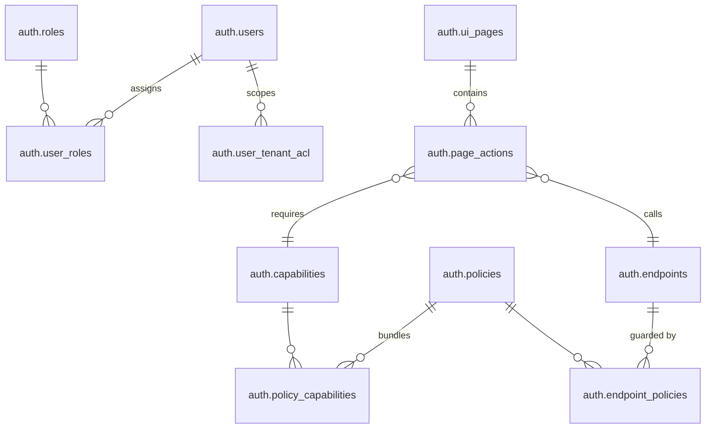

# Data Map & Relationships

**Navigation:** Previous: [Architecture Overview](overview.md) → Next: [Journey: Login To Data](../guides/login-to-data.md)

This guide maps the PostgreSQL tables that power authentication and authorization. Use it when you need to understand how roles, policies, capabilities, and tenant scopes join together.

## Core Entities



**Note:** The current schema uses `policies.expression` (JSON with roles array) instead of a separate `role_policies` junction table.

## Entity Descriptions

### 🔐 **auth.users** - Core User Records
Stores human users and service accounts. Every login, API call, and permission check starts here.

| Column | Type | Purpose |
| --- | --- | --- |
| `id` | UUID | Primary key |
| `username` | TEXT | Unique login identifier |
| `email` | TEXT | Contact information |
| `status` | ENUM | ACTIVE, DISABLED, LOCKED |
| `is_service_account` | BOOLEAN | Flag for service accounts (token-only) |
| `created_at` | TIMESTAMP | Audit trail |

**Examples:**
- `worker.demo` (human user, WORKER role)
- `employer.acme` (human user, EMPLOYER role)
- `payment-sync-bot` (service account, automation)

---

### 👤 **auth.roles** - Responsibility Badges
Groups users by job function. Think of roles as "responsibility badges" that multiple people wear.

| Column | Type | Purpose |
| --- | --- | --- |
| `id` | UUID | Primary key |
| `name` | TEXT | Role name (e.g., WORKER, EMPLOYER, ADMIN) |
| `description` | TEXT | Purpose and scope |
| `is_active` | BOOLEAN | Enable/disable entire role |

**Examples:**
- WORKER - Employees submitting payment docs
- EMPLOYER - Managers reviewing submissions
- BOARD - C-suite approval authority
- PLATFORM_ADMIN - System maintenance

**Typical Count:** 5-10 roles per organization

---

### 📋 **auth.policies** - Rulebooks
Bundles of capabilities tied to roles. A policy says "if you have this role, you can do these things."

| Column | Type | Purpose |
| --- | --- | --- |
| `id` | BIGINT | Primary key |
| `name` | VARCHAR | Policy name (e.g., USER_ACCOUNT_MANAGE_POLICY) |
| `description` | TEXT | Intent and scope |
| `type` | VARCHAR | Policy type (RBAC, ABAC, CUSTOM) |
| `expression` | JSON | Role binding: `{"roles": ["ROLE_NAME"]}` |
| `is_active` | BOOLEAN | Enable/disable entire policy |

**Example:**
```json
{
  "name": "USER_ACCOUNT_MANAGE_POLICY",
  "description": "Manage user accounts and lifecycle operations",
  "expression": {"roles": ["BUSINESS_ADMIN", "TECHNICAL_BOOTSTRAP"]}
}
```

**Role Resolution:** The `expression` field contains a JSON object with a `roles` array. Users with roles matching those in the array inherit all capabilities linked to this policy via `policy_capabilities`.

---

### 💡 **auth.capabilities** - Atomic Permissions
Smallest unit of permission (e.g., "read users" or "update user"). Named as `<domain>.<subject>.<action>`.

| Column | Type | Purpose |
| --- | --- | --- |
| `id` | BIGINT | Primary key |
| `name` | VARCHAR | Unique identifier (e.g., user.account.update) |
| `description` | TEXT | Human-readable purpose |
| `module` | VARCHAR | Module grouping (user, rbac, policy, etc.) |
| `action` | VARCHAR | Operation (CREATE, READ, UPDATE, DELETE, etc.) |
| `resource` | VARCHAR | Target resource (USER, ROLE, POLICY, etc.) |
| `is_active` | BOOLEAN | Enable/disable capability |

**Examples:**
- `user.account.create` - Create new user accounts
- `user.account.read` - View user information
- `user.account.update` - Modify user details
- `user.account.delete` - Delete/disable users
- `rbac.policy.manage` - Manage authorization policies

**Typical Count:** 91 capabilities in bootstrap (can grow to 100+)

---

### 🔗 **auth.page_actions** - UI Action Bindings
Links UI actions to both capabilities (permissions) and endpoints (API calls). **Dual-purpose table**.

| Column | Type | Purpose |
| --- | --- | --- |
| `id` | BIGINT | Primary key |
| `page_id` | INTEGER | FK to ui_pages (which page) |
| `label` | VARCHAR | Button/action label (e.g., "Edit User") |
| `action` | VARCHAR | Action type (CREATE, UPDATE, DELETE, etc.) |
| `capability_id` | BIGINT | FK to capabilities (permission check) |
| `endpoint_id` | BIGINT | FK to endpoints (API call target) |
| `icon` | VARCHAR | Icon name for UI |
| `variant` | VARCHAR | Button style (default, success, danger, etc.) |

**Dual Purpose:**
1. **Permission Check**: `capability_id` → Does user have this capability?
2. **API Binding**: `endpoint_id` → Which endpoint to call when clicked?

**Example:**
```sql
-- "Edit User" button on User Management page
INSERT INTO auth.page_actions (page_id, label, capability_id, endpoint_id)
VALUES (
  2,                          -- User Management page
  'Edit User',
  3,                          -- capability: user.account.update
  71                          -- endpoint: PUT /api/auth/users/{userId}
);
```

**Frontend Flow:**
```
GET /api/meta/endpoints?page_id=2
  ↓
Returns page_actions WHERE user has capability_id
  ↓
Frontend renders buttons with endpoint_id for API calls
```

---

### 🔗 **auth.endpoints** - HTTP Guards
Every API endpoint that needs protection is registered here. Defines method + path + requirements.

| Column | Type | Purpose |
| --- | --- | --- |
| `id` | BIGINT | Primary key |
| `service` | VARCHAR | Service name (AUTH, ADMIN, INTERNAL) |
| `version` | VARCHAR | API version (v1, v2) |
| `method` | VARCHAR | GET, POST, PUT, DELETE, PATCH |
| `path` | VARCHAR | Route pattern (e.g., /api/auth/users/{userId}) |
| `description` | TEXT | Human description |
| `ui_type` | VARCHAR | UI interaction type (ACTION, LIST, FORM, etc.) |
| `is_active` | BOOLEAN | Enable/disable endpoint |
| `created_at` | TIMESTAMP | Audit |
| `updated_at` | TIMESTAMP | Last modified |

**Examples:**
- GET `/api/auth/users` → List all users (endpoint_id: 5)
- POST `/api/auth/users` → Create new user (endpoint_id: 3)
- PUT `/api/auth/users/{userId}` → Update user (endpoint_id: 71)
- DELETE `/api/auth/users/{userId}` → Delete user (endpoint_id: 72)

**Bootstrap Setup:** 72 endpoints registered
- AUTH service: 14 endpoints
- ADMIN service: 51 endpoints  
- INTERNAL service: 5 endpoints

---

### 🔐 **auth.ui_pages** - Front-End Surfaces
Pages/sections in the UI. Organized hierarchically with parent-child relationships.

| Column | Type | Purpose |
| --- | --- | --- |
| `id` | BIGINT | Primary key |
| `page_id` | VARCHAR | Unique identifier (e.g., user-mgmt, role-mgmt) |
| `label` | VARCHAR | Display name |
| `route` | VARCHAR | URL path |
| `icon` | VARCHAR | Icon name for navigation |
| `module` | VARCHAR | Module grouping |
| `parent_id` | BIGINT | FK to ui_pages (for hierarchy) |
| `display_order` | INTEGER | Menu ordering |
| `is_menu_item` | BOOLEAN | Show in navigation? |
| `is_active` | BOOLEAN | Enable/disable page |
| `required_capability` | VARCHAR | Optional capability for page access |

**Examples:**
- Dashboard (page_id: dashboard) → `/admin/dashboard`
- User Management (page_id: user-mgmt) → `/admin/users`
- Role Management (page_id: role-mgmt) → `/admin/roles`
- Policy Management (page_id: policy-mgmt) → `/admin/policies`

**Bootstrap Setup:** 10 UI pages with 16 page actions

---

### 🌐 **auth.user_tenant_acl** - Data Scope Limiter
Defines which organizations/employers a user can access. Powers Row-Level Security (RLS).

| Column | Type | Purpose |
| --- | --- | --- |
| `id` | BIGINT | Primary key |
| `user_id` | BIGINT | Foreign key to auth.users |
| `board_id` | VARCHAR | Board identifier (e.g., 'BOARD_001') |
| `employer_id` | VARCHAR | Organization identifier (nullable) |
| `can_read` | BOOLEAN | Read access flag |
| `can_write` | BOOLEAN | Write access flag |
| `created_at` | TIMESTAMP | Audit |
| `updated_at` | TIMESTAMP | Last modified |

**Example:**
- worker.demo can only see data where board_id='BOARD_001'
- employer.acme can see all workers in board_id='BOARD_001', employer_id='EMP_001'
- board.member can see reports across all employers in their board

---

## Junction Tables (Relationships)

### **auth.user_roles** - User ↔ Role Assignment
Who has which role (many-to-many).

| Column | Type | Purpose |
| --- | --- | --- |
| `id` | BIGINT | Primary key |
| `user_id` | BIGINT | FK to users |
| `role_id` | BIGINT | FK to roles |
| `created_at` | TIMESTAMP | Audit |

```
business.admin → [user_roles] → BASIC_USER role
business.admin → [user_roles] → BUSINESS_ADMIN role
tech.bootstrap → [user_roles] → BASIC_USER role
tech.bootstrap → [user_roles] → TECHNICAL_BOOTSTRAP role
```

---

### **auth.policy_capabilities** - Policy ↔ Capability Bundle
Which capabilities are inside each policy.

| Column | Type | Purpose |
| --- | --- | --- |
| `id` | BIGINT | Primary key |
| `policy_id` | BIGINT | FK to policies |
| `capability_id` | BIGINT | FK to capabilities |

```
USER_ACCOUNT_MANAGE_POLICY → [policy_capabilities] → user.account.create
USER_ACCOUNT_MANAGE_POLICY → [policy_capabilities] → user.account.read
USER_ACCOUNT_MANAGE_POLICY → [policy_capabilities] → user.account.update
USER_ACCOUNT_MANAGE_POLICY → [policy_capabilities] → user.account.delete
```

**Bootstrap Setup:** 56 policy-capability links

---

### **auth.endpoint_policies** - Endpoint ↔ Policy Guard
Which policies protect which endpoints.

| Column | Type | Purpose |
| --- | --- | --- |
| `id` | BIGINT | Primary key |
| `endpoint_id` | BIGINT | FK to endpoints |
| `policy_id` | BIGINT | FK to policies |

```
GET /api/auth/users → [endpoint_policies] → USER_ACCOUNT_MANAGE_POLICY
PUT /api/auth/users/{userId} → [endpoint_policies] → USER_ACCOUNT_MANAGE_POLICY
DELETE /api/auth/users/{userId} → [endpoint_policies] → USER_ACCOUNT_MANAGE_POLICY
```

**Bootstrap Setup:** 72 endpoint-policy links (one per endpoint)

---

## Authorization Resolution

### Backend: "Can user X call endpoint Y?"
```sql
-- Check if user's roles grant access to an endpoint
SELECT EXISTS(
  SELECT 1
  FROM auth.users u
  JOIN auth.user_roles ur ON u.id = ur.user_id
  JOIN auth.roles r ON ur.role_id = r.id
  JOIN auth.policies p ON p.expression->>'roles' ? r.name
  JOIN auth.endpoint_policies ep ON p.id = ep.policy_id
  JOIN auth.endpoints e ON ep.endpoint_id = e.id
  WHERE u.id = :userId
    AND e.method = 'PUT'
    AND e.path = '/api/auth/users/{userId}'
) as has_access;
```

### Frontend: "What actions can user X perform on page Y?"
```sql
-- Get available page actions for a user
SELECT 
  pa.id,
  pa.label,
  pa.action,
  c.name as capability,
  e.method,
  e.path
FROM auth.page_actions pa
JOIN auth.capabilities c ON pa.capability_id = c.id
JOIN auth.endpoints e ON pa.endpoint_id = e.id
WHERE pa.page_id = :pageId
  AND EXISTS(
    SELECT 1
    FROM auth.user_roles ur
    JOIN auth.roles r ON ur.role_id = r.id
    JOIN auth.policies p ON p.expression->>'roles' ? r.name
    JOIN auth.policy_capabilities pc ON p.id = pc.policy_id
    WHERE ur.user_id = :userId
      AND pc.capability_id = pa.capability_id
  );
```

---

## Read Paths (Common Queries)

### "What can user X do?"
```sql
SELECT DISTINCT c.name
FROM auth.users u
JOIN auth.user_roles ur ON u.id = ur.user_id
JOIN auth.roles r ON ur.role_id = r.id
JOIN auth.role_policies rp ON r.id = rp.role_id
JOIN auth.policies p ON rp.policy_id = p.id
JOIN auth.policy_capabilities pc ON p.id = pc.policy_id
JOIN auth.capabilities c ON pc.capability_id = c.id
WHERE u.id = $1 AND u.status = 'ACTIVE'
ORDER BY c.name;
```

### "Which users can access endpoint X?"
```sql
SELECT DISTINCT u.username
FROM auth.endpoints e
JOIN auth.endpoint_policies ep ON e.id = ep.endpoint_id
JOIN auth.policies p ON ep.policy_id = p.id
JOIN auth.role_policies rp ON p.id = rp.policy_id
JOIN auth.roles r ON rp.role_id = r.id
JOIN auth.user_roles ur ON r.id = ur.role_id
JOIN auth.users u ON ur.user_id = u.id
WHERE e.method = $1 AND e.path = $2
AND u.status = 'ACTIVE';
```

### "What data can user X see?" (with RLS)
```sql
SELECT u.id, u.employer_id, u.board_id
FROM auth.user_tenant_acl u
WHERE user_id = $1;

-- Then filter business queries:
SELECT * FROM payments 
WHERE employer_id IN (SELECT employer_id FROM auth.user_tenant_acl WHERE user_id = $1);
```

## Example: Worker Fetches Payslip

## Example: Worker Fetches Payslip

1. `auth.user` record for `worker.demo`.
2. `auth.user_role` links to `WORKER`.
3. `auth.role_policy` activates `WORKER_POLICY`.
4. `auth.policy_capability` includes `payment.details.read`.
5. `auth.endpoint_policy` ensures `GET /payment-requests/:id` requires `WORKER_POLICY`.
6. `auth.user_tenant_acl` restricts rows to the worker’s employer.

Every table participates in the decision.

## Reference Links

- Detailed CSV-friendly exports remain in [reference/raw/RBAC/](../reference/raw/RBAC/).
- VPD policy scripts and tests live in [reference/raw/VPD/](../reference/raw/VPD/).
- Onboarding SQL stays in [onboarding/setup/](../onboarding/setup/).

## Up Next

Proceed to [Journey: Login To Data](../guides/login-to-data.md) for a narrative walkthrough from login to data access using real personas.
