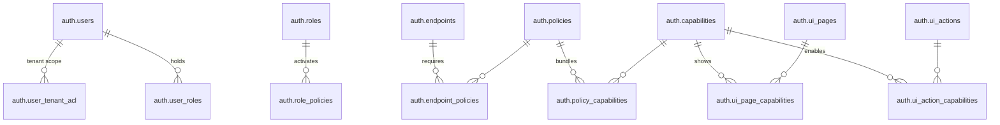

# Data Map & Relationships

**Navigation:** Previous: [Architecture Overview](overview.md) → Next: [Journey: Login To Data](../guides/login-to-data.md)

This guide maps the PostgreSQL tables that power authentication and authorization. Use it when you need to understand how roles, policies, capabilities, and tenant scopes join together.

## Core Entities

- **Users** connect to **Roles** via `auth.user_role`.
- **Roles** activate **Policies** (`auth.role_policy`).
- **Policies** group **Capabilities** (`auth.policy_capability`).
- **Endpoints** require policies (`auth.endpoint_policy`).
- **UI pages & actions** map back to capabilities so the front-end respects the same rules.
- **Tenant ACL** defines which boards/employers a user can see for RLS.

## Table Cheat-Sheet

| Table | Purpose | Key Columns |
| --- | --- | --- |
| `auth.user` | Human users and service accounts | `id`, `username`, `status` |
| `auth.role` | Responsibility badges | `id`, `name` |
| `auth.policy` | Rulebooks tied to roles | `id`, `name`, `description` |
| `auth.capability` | Atomic permissions | `id`, `name`, `description` |
| `auth.endpoint` | HTTP methods + paths | `id`, `method`, `path` |
| `auth.ui_page` | Front-end pages | `id`, `code`, `description` |
| `auth.ui_action` | Buttons/links/events | `id`, `code`, `description` |
| `auth.user_tenant_acl` | Tenant scope per user | `user_id`, `board_id`, `employer_id` |

## Example: Worker Fetches Payslip

1. `auth.user` record for `worker.demo`.
2. `auth.user_role` links to `WORKER`.
3. `auth.role_policy` activates `WORKER_POLICY`.
4. `auth.policy_capability` includes `payment.details.read`.
5. `auth.endpoint_policy` ensures `GET /payment-requests/:id` requires `WORKER_POLICY`.
6. `auth.user_tenant_acl` restricts rows to the worker’s employer.

Every table participates in the decision.

## Reference Links

- Detailed CSV-friendly exports remain in [reference/raw/RBAC/](../reference/raw/RBAC/).
- VPD policy scripts and tests live in [reference/raw/VPD/](../reference/raw/VPD/).
- Onboarding SQL stays in [onboarding/setup/](../onboarding/setup/).

## Up Next

Proceed to [Journey: Login To Data](../guides/login-to-data.md) for a narrative walkthrough from login to data access using real personas.
