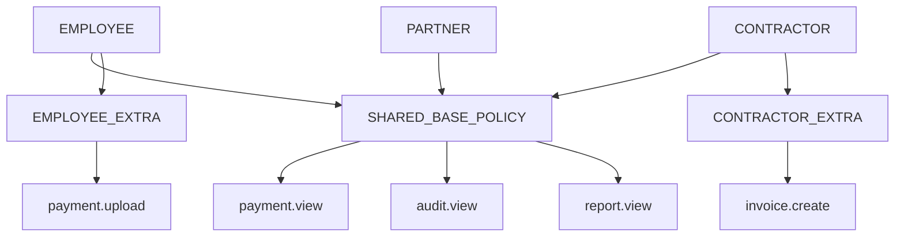

# Common Permission Patterns

**Navigation:** Previous: [Policy Binding](policy-binding.md) → Next: [Troubleshooting Guide](../playbooks/troubleshoot-auth.md)

This guide shows real-world patterns for setting up common permission scenarios.

## Pattern 1: Read-Only Viewer Role

### **Scenario**
Users who can view data but cannot modify anything.

### **Setup**

```sql
-- 1. Create VIEWER role
INSERT INTO auth.roles (name, description, is_active, created_at, updated_at)
VALUES ('VIEWER', 'Read-only access to dashboards and reports', true, NOW(), NOW())
ON CONFLICT (name) DO NOTHING;

-- 2. Create VIEWER_POLICY
INSERT INTO auth.policies (name, description, is_active, created_at, updated_at)
VALUES ('VIEWER_POLICY', 'Grants read-only capabilities', true, NOW(), NOW())
ON CONFLICT (name) DO NOTHING;

-- 3. Link role to policy
INSERT INTO auth.role_policies (role_id, policy_id, created_at)
SELECT r.id, p.id, NOW()
FROM auth.roles r, auth.policies p
WHERE r.name = 'VIEWER' AND p.name = 'VIEWER_POLICY'
ON CONFLICT (role_id, policy_id) DO NOTHING;

-- 4. Create read-only capabilities
INSERT INTO auth.capabilities (name, description, is_active, created_at, updated_at)
VALUES 
  ('payment.view', 'View payment records', true, NOW(), NOW()),
  ('report.view', 'View reports', true, NOW(), NOW()),
  ('audit.view', 'View audit logs', true, NOW(), NOW())
ON CONFLICT (name) DO NOTHING;

-- 5. Link capabilities to policy
INSERT INTO auth.policy_capabilities (policy_id, capability_id, created_at)
SELECT p.id, c.id, NOW()
FROM auth.policies p, auth.capabilities c
WHERE p.name = 'VIEWER_POLICY'
  AND c.name IN ('payment.view', 'report.view', 'audit.view')
ON CONFLICT (policy_id, capability_id) DO NOTHING;

-- 6. Register read endpoints
INSERT INTO auth.endpoints (method, path, label, description, is_active, created_at, updated_at)
VALUES 
  ('GET', '/api/payments', 'List payments', 'Fetch all payments', true, NOW(), NOW()),
  ('GET', '/api/payments/:id', 'Get payment', 'Fetch single payment', true, NOW(), NOW()),
  ('GET', '/api/reports', 'List reports', 'Fetch all reports', true, NOW(), NOW()),
  ('GET', '/api/audit-logs', 'View audit logs', 'Fetch audit logs', true, NOW(), NOW())
ON CONFLICT (method, path) DO NOTHING;

-- 7. Guard endpoints with policy
INSERT INTO auth.endpoint_policies (endpoint_id, policy_id, created_at)
SELECT e.id, p.id, NOW()
FROM auth.endpoints e, auth.policies p
WHERE e.path IN ('/api/payments', '/api/payments/:id', '/api/reports', '/api/audit-logs')
  AND e.method = 'GET'
  AND p.name = 'VIEWER_POLICY'
ON CONFLICT (endpoint_id, policy_id) DO NOTHING;
```

### **Verification**

```sql
-- Verify VIEWER role has correct capabilities
SELECT r.name, c.name
FROM auth.roles r
JOIN auth.role_policies rp ON r.id = rp.role_id
JOIN auth.policies p ON rp.policy_id = p.id
JOIN auth.policy_capabilities pc ON p.id = pc.policy_id
JOIN auth.capabilities c ON pc.capability_id = c.id
WHERE r.name = 'VIEWER'
ORDER BY c.name;
```

### **API Usage**

```bash
# Create VIEWER role via API
curl -X POST http://localhost:8080/api/admin/roles \
  -H "Content-Type: application/json" \
  -H "Authorization: Bearer $ADMIN_TOKEN" \
  -d '{
    "name": "VIEWER",
    "description": "Read-only access to dashboards and reports"
  }'

# Assign user to VIEWER role
curl -X POST http://localhost:8080/api/admin/users/{userId}/roles \
  -H "Content-Type: application/json" \
  -H "Authorization: Bearer $ADMIN_TOKEN" \
  -d '{
    "roleIds": [3]
  }'
```

---

## Pattern 2: Progressive Permissions (Viewer → Editor → Admin)

### **Scenario**
Users progress through role hierarchy with increasing permissions.

### **Hierarchy**
```
VIEWER (read-only)
  ↓
EDITOR (read + write)
  ↓
ADMIN (read + write + delete + manage)
```

### **Setup**

```sql
-- Create three roles
INSERT INTO auth.roles (name, description) VALUES
  ('VIEWER', 'Read-only access'),
  ('EDITOR', 'Read and write access'),
  ('ADMIN', 'Full administrative access');

-- Create three policies
INSERT INTO auth.policies (name, description) VALUES
  ('VIEWER_POLICY', 'Read-only capabilities'),
  ('EDITOR_POLICY', 'Read and write capabilities'),
  ('ADMIN_POLICY', 'Full administrative capabilities');

-- Create capabilities at each level
INSERT INTO auth.capabilities (name, description) VALUES
  -- Read tier
  ('resource.view', 'View resources'),
  ('audit.view', 'View audit logs'),
  
  -- Write tier (includes read)
  ('resource.create', 'Create new resources'),
  ('resource.update', 'Update existing resources'),
  
  -- Admin tier (includes all)
  ('resource.delete', 'Delete resources'),
  ('role.manage', 'Manage roles'),
  ('policy.manage', 'Manage policies');

-- Map capabilities to policies
-- VIEWER_POLICY gets read-only
INSERT INTO auth.policy_capabilities (policy_id, capability_id)
SELECT p.id, c.id
FROM auth.policies p, auth.capabilities c
WHERE p.name = 'VIEWER_POLICY'
  AND c.name IN ('resource.view', 'audit.view');

-- EDITOR_POLICY gets read + write (cumulative)
INSERT INTO auth.policy_capabilities (policy_id, capability_id)
SELECT p.id, c.id
FROM auth.policies p, auth.capabilities c
WHERE p.name = 'EDITOR_POLICY'
  AND c.name IN ('resource.view', 'audit.view', 'resource.create', 'resource.update');

-- ADMIN_POLICY gets everything
INSERT INTO auth.policy_capabilities (policy_id, capability_id)
SELECT p.id, c.id
FROM auth.policies p, auth.capabilities c
WHERE p.name = 'ADMIN_POLICY'
  AND c.name IN (
    'resource.view', 'audit.view', 
    'resource.create', 'resource.update', 
    'resource.delete', 'role.manage', 'policy.manage'
  );

-- Link roles to policies
INSERT INTO auth.role_policies (role_id, policy_id)
SELECT r.id, p.id
FROM auth.roles r, auth.policies p
WHERE (r.name = 'VIEWER' AND p.name = 'VIEWER_POLICY')
   OR (r.name = 'EDITOR' AND p.name = 'EDITOR_POLICY')
   OR (r.name = 'ADMIN' AND p.name = 'ADMIN_POLICY');

-- Register endpoints at each tier
INSERT INTO auth.endpoints (method, path, label) VALUES
  -- Read tier
  ('GET', '/api/resources', 'List resources'),
  ('GET', '/api/resources/:id', 'Get resource'),
  
  -- Write tier
  ('POST', '/api/resources', 'Create resource'),
  ('PUT', '/api/resources/:id', 'Update resource'),
  
  -- Admin tier
  ('DELETE', '/api/resources/:id', 'Delete resource'),
  ('GET', '/api/admin/roles', 'Manage roles'),
  ('POST', '/api/admin/policies', 'Manage policies');

-- Guard endpoints with policies
INSERT INTO auth.endpoint_policies (endpoint_id, policy_id)
SELECT e.id, p.id
FROM auth.endpoints e, auth.policies p
WHERE (e.method = 'GET' AND p.name IN ('VIEWER_POLICY', 'EDITOR_POLICY', 'ADMIN_POLICY'))
   OR (e.method = 'POST' AND e.path = '/api/resources' AND p.name IN ('EDITOR_POLICY', 'ADMIN_POLICY'))
   OR (e.method = 'PUT' AND p.name IN ('EDITOR_POLICY', 'ADMIN_POLICY'))
   OR (e.method = 'DELETE' AND p.name = 'ADMIN_POLICY')
   OR (e.path LIKE '/api/admin/%' AND p.name = 'ADMIN_POLICY');
```

### **Permission Matrix**

| Endpoint | Method | VIEWER | EDITOR | ADMIN |
|----------|--------|--------|--------|-------|
| /api/resources | GET | ✅ | ✅ | ✅ |
| /api/resources | POST | ❌ | ✅ | ✅ |
| /api/resources/:id | PUT | ❌ | ✅ | ✅ |
| /api/resources/:id | DELETE | ❌ | ❌ | ✅ |
| /api/admin/roles | GET | ❌ | ❌ | ✅ |
| /api/admin/policies | POST | ❌ | ❌ | ✅ |

---

## Pattern 3: Organization-Based Scoping (Multi-Tenant)

### **Scenario**
Same permission structure, but scoped to organization (via RLS).

### **Setup**

```sql
-- Create roles (same for all orgs)
INSERT INTO auth.roles (name, description) VALUES
  ('ORG_VIEWER', 'Viewer within organization'),
  ('ORG_EDITOR', 'Editor within organization'),
  ('ORG_ADMIN', 'Admin within organization');

-- Create policies
INSERT INTO auth.policies (name, description) VALUES
  ('ORG_POLICY', 'Organization-level access');

-- Map capabilities
INSERT INTO auth.policy_capabilities (policy_id, capability_id)
SELECT p.id, c.id
FROM auth.policies p, auth.capabilities c
WHERE p.name = 'ORG_POLICY'
  AND c.name IN ('resource.view', 'resource.create', 'resource.update', 'resource.delete');

-- Assign role to policy
INSERT INTO auth.role_policies (role_id, policy_id)
SELECT r.id, p.id
FROM auth.roles r, auth.policies p
WHERE r.name LIKE 'ORG_%' AND p.name = 'ORG_POLICY';

-- RLS: User can only see data from their organization
-- This is enforced by auth.user_tenant_acl in the WHERE clause
```

### **RLS Protection**

```sql
-- Set user context before querying
SELECT auth.set_user_context('user-123');

-- Now query only returns rows for user's org
SELECT * FROM payment_requests
WHERE organization_id = (
  SELECT organization_id FROM auth.user_tenant_acl
  WHERE user_id = current_user_id()
);
```

---

## Pattern 4: Time-Bounded Permissions

### **Scenario**
Permissions that are temporarily elevated (e.g., on-call engineer).

### **Setup**

```sql
-- Create time-bound role
INSERT INTO auth.roles (name, description, effective_from, effective_until)
VALUES 
  ('ONCALL_ENGINEER', 
   'Temporary elevated access for on-call engineer', 
   NOW(),
   NOW() + INTERVAL '1 week');

-- Create temporary policy
INSERT INTO auth.policies (name, description, effective_from, effective_until)
VALUES
  ('ONCALL_EMERGENCY_POLICY',
   'Emergency access (valid only during on-call shift)',
   NOW(),
   NOW() + INTERVAL '1 week');

-- Link and verify
SELECT NOW() < r.effective_until as is_active
FROM auth.roles r
WHERE r.name = 'ONCALL_ENGINEER';
```

---

## Pattern 5: Capability Inheritance via Shared Policies

### **Scenario**
Multiple roles sharing the same capabilities without duplication.

### **Diagram**



### **Setup**

```sql
-- Create shared policy for common capabilities
INSERT INTO auth.policies (name, description)
VALUES ('SHARED_BASE_POLICY', 'Common capabilities for all external roles');

-- Create role-specific policies
INSERT INTO auth.policies (name, description)
VALUES 
  ('EMPLOYEE_EXTRA', 'Employee-specific additions'),
  ('CONTRACTOR_EXTRA', 'Contractor-specific additions');

-- Add roles
INSERT INTO auth.roles (name) VALUES ('EMPLOYEE'), ('CONTRACTOR'), ('PARTNER');

-- Both EMPLOYEE and CONTRACTOR get SHARED_BASE_POLICY
INSERT INTO auth.role_policies (role_id, policy_id)
SELECT r.id, p.id
FROM auth.roles r, auth.policies p
WHERE r.name IN ('EMPLOYEE', 'CONTRACTOR', 'PARTNER')
  AND p.name = 'SHARED_BASE_POLICY';

-- Add role-specific policies
INSERT INTO auth.role_policies (role_id, policy_id)
SELECT r.id, p.id
FROM auth.roles r, auth.policies p
WHERE (r.name = 'EMPLOYEE' AND p.name = 'EMPLOYEE_EXTRA')
   OR (r.name = 'CONTRACTOR' AND p.name = 'CONTRACTOR_EXTRA');
```

### **Result**
- EMPLOYEE gets: SHARED + EMPLOYEE_EXTRA
- CONTRACTOR gets: SHARED + CONTRACTOR_EXTRA
- PARTNER gets: SHARED only

---

## Troubleshooting Permission Patterns

### **"User can't access endpoint"**

1. Verify user's role → check `auth.user_roles`
2. Verify role's policy → check `auth.role_policies`
3. Verify policy's capabilities → check `auth.policy_capabilities`
4. Verify endpoint is guarded → check `auth.endpoint_policies`
5. If all match, check RLS → verify `auth.user_tenant_acl`

### **"Multiple roles give conflicting permissions"**

A user with both VIEWER and EDITOR roles will have the **union** of capabilities:
- User gets: (VIEWER capabilities) + (EDITOR capabilities)
- Most permissive policy wins

### **"Performance degraded after adding many policies"**

- Cache the entire permission matrix per user after login
- Refresh every 5-10 minutes or on explicit update
- Use database indexes on `user_id`, `role_id`, `policy_id`

---

## Next Steps

- Apply these patterns to your specific domain
- See [RBAC Setup Playbook](../guides/setup/rbac.md) for step-by-step implementation
- Review [Troubleshooting Guide](../playbooks/troubleshoot-auth.md) if issues arise
