# Policy Binding Relationships

**Navigation:** Previous: [Request Lifecycle](request-lifecycle.md) → Next: [Common Permission Patterns](permission-patterns.md)

This document explains how policies, capabilities, roles, and endpoints connect to form the authorization matrix.

## The Four Binding Layers

### **Layer 1: Role ⟷ Policy Binding**
Defines which roles activate which policies.

```mermaid
graph TD
    R1["👤 Role: EMPLOYEE"] --> P1["📋 Policy: EMPLOYEE_POLICY"]
    R1 --> P2["📋 Policy: VIEWER_POLICY"]
    
    R2["👤 Role: MANAGER"] --> P2
    R2 --> P3["📋 Policy: MANAGER_POLICY"]
    
    R3["👤 Role: ADMIN"] --> P1
    R3 --> P2
    R3 --> P3
    R3 --> P4["📋 Policy: ADMIN_POLICY"]
    
    style P1 fill:#e1f5ff
    style P2 fill:#e1f5ff
    style P3 fill:#fff3e0
    style P4 fill:#ffebee
```



**Database:**
```sql
-- auth.role_policies table
SELECT r.name as role, p.name as policy
FROM auth.role_policies rp
JOIN auth.roles r ON rp.role_id = r.id
JOIN auth.policies p ON rp.policy_id = p.id
ORDER BY r.name;

-- Example output:
-- EMPLOYEE  | EMPLOYEE_POLICY
-- EMPLOYEE  | VIEWER_POLICY
-- MANAGER   | MANAGER_POLICY
-- MANAGER   | VIEWER_POLICY
-- ADMIN     | ADMIN_POLICY
```

---

### **Layer 2: Policy ⟷ Capability Binding**
Defines which capabilities each policy grants.

```mermaid
graph TD
    P1["📋 Policy: EMPLOYEE_POLICY"] --> C1["🔑 Cap: payment.upload"]
    P1 --> C2["🔑 Cap: payment.view"]
    P1 --> C3["🔑 Cap: audit.view"]
    
    P2["📋 Policy: VIEWER_POLICY"] --> C3
    P2 --> C4["🔑 Cap: report.view"]
    
    P3["📋 Policy: ADMIN_POLICY"] --> C1
    P3 --> C2
    P3 --> C3
    P3 --> C4
    P3 --> C5["🔑 Cap: payment.delete"]
    P3 --> C6["🔑 Cap: role.manage"]
    
    style P1 fill:#e1f5ff
    style P2 fill:#e1f5ff
    style P3 fill:#ffebee
```



**Database:**
```sql
-- auth.policy_capabilities table
SELECT p.name as policy, c.name as capability
FROM auth.policy_capabilities pc
JOIN auth.policies p ON pc.policy_id = p.id
JOIN auth.capabilities c ON pc.capability_id = c.id
ORDER BY p.name, c.name;

-- Example output:
-- ADMIN_POLICY     | audit.view
-- ADMIN_POLICY     | payment.delete
-- ADMIN_POLICY     | payment.upload
-- ADMIN_POLICY     | payment.view
-- ADMIN_POLICY     | report.view
-- ADMIN_POLICY     | role.manage
-- EMPLOYEE_POLICY  | audit.view
-- EMPLOYEE_POLICY  | payment.upload
-- EMPLOYEE_POLICY  | payment.view
-- VIEWER_POLICY    | audit.view
-- VIEWER_POLICY    | report.view
```

---

### **Layer 3: Endpoint ⟷ Policy Binding**
Defines which endpoints are guarded by which policies.

```mermaid
graph TD
    E1["🔌 GET /api/payments"] --> P1["📋 VIEWER_POLICY"]
    E1 --> P2["📋 EMPLOYEE_POLICY"]
    
    E2["🔌 POST /api/payments"] --> P2
    E2 --> P3["📋 ADMIN_POLICY"]
    
    E3["🔌 DELETE /api/payments/:id"] --> P3
    
    E4["🔌 GET /api/reports"] --> P1
    
    style E1 fill:#f3e5f5
    style E2 fill:#f3e5f5
    style E3 fill:#f3e5f5
    style E4 fill:#f3e5f5
    style P1 fill:#e1f5ff
    style P2 fill:#e1f5ff
    style P3 fill:#ffebee
```



**Database:**
```sql
-- auth.endpoint_policies table
SELECT e.method, e.path, p.name as policy
FROM auth.endpoint_policies ep
JOIN auth.endpoints e ON ep.endpoint_id = e.id
JOIN auth.policies p ON ep.policy_id = p.id
ORDER BY e.method, e.path;

-- Example output:
-- DELETE | /api/payments/:id      | ADMIN_POLICY
-- GET    | /api/payments          | VIEWER_POLICY
-- GET    | /api/payments          | EMPLOYEE_POLICY
-- GET    | /api/reports           | VIEWER_POLICY
-- POST   | /api/payments          | EMPLOYEE_POLICY
-- POST   | /api/payments          | ADMIN_POLICY
```

---

### **Layer 4: Capability ⟷ UI Binding**
Defines which UI pages/actions are visible based on capabilities.

```mermaid
graph TD
    C1["🔑 Cap: payment.view"] --> UI1["🎨 Page: Payment Dashboard"]
    C1 --> UI2["🎯 Action: View Details Button"]
    
    C2["🔑 Cap: payment.upload"] --> UI3["🎨 Page: Upload Form"]
    C2 --> UI4["🎯 Action: Submit Button"]
    
    C3["🔑 Cap: payment.delete"] --> UI5["🎯 Action: Delete Button"]
    
    style C1 fill:#e8f5e9
    style C2 fill:#e8f5e9
    style C3 fill:#e8f5e9
```



**Database:**
```sql
-- UI pages linked to capabilities
SELECT c.name, p.code as page_code
FROM auth.ui_page_capabilities upc
JOIN auth.capabilities c ON upc.capability_id = c.id
JOIN auth.ui_pages p ON upc.page_id = p.id;

-- UI actions linked to capabilities
SELECT c.name, a.code as action_code
FROM auth.ui_action_capabilities uac
JOIN auth.capabilities c ON uac.capability_id = c.id
JOIN auth.ui_actions a ON uac.action_id = a.id;
```

---

## Complete Permission Matrix Example

### **Scenario: Three Users, Three Roles**

| User | Role | Policy | Capabilities | Can Do |
|------|------|--------|--------------|--------|
| **alice** | EMPLOYEE | EMPLOYEE_POLICY, VIEWER_POLICY | payment.upload, payment.view, audit.view, report.view | Upload, View, Read reports |
| **bob** | MANAGER | MANAGER_POLICY, VIEWER_POLICY | payment.upload, payment.view, audit.view, report.view, approval.grant | Upload, View, Reports, Approve |
| **charlie** | ADMIN | ADMIN_POLICY | payment.*, audit.*, report.*, role.manage | Everything |

### **Permission Decision Table**

| Request | User | Policy | Has Capability? | Endpoint Guarded? | Result |
|---------|------|--------|-----------------|-------------------|--------|
| GET /api/payments | alice (EMPLOYEE) | EMPLOYEE_POLICY | ✅ payment.view | ✅ Yes | **✅ ALLOW** |
| POST /api/payments | alice | EMPLOYEE_POLICY | ✅ payment.upload | ✅ Yes | **✅ ALLOW** |
| DELETE /api/payments/1 | alice | EMPLOYEE_POLICY | ❌ payment.delete | ✅ Yes | **❌ DENY** |
| DELETE /api/payments/1 | charlie (ADMIN) | ADMIN_POLICY | ✅ payment.delete | ✅ Yes | **✅ ALLOW** |

---

## How Bindings Work Together

### **End-to-End Flow**

```mermaid
sequenceDiagram
    participant User
    participant JWT
    participant RolePolicy as Role→Policy<br/>Binding
    participant PolicyCap as Policy→Capability<br/>Binding
    participant EndpointPolicy as Endpoint→Policy<br/>Binding
    participant RLS
    participant Data

    User->>JWT: Extract roles
    JWT->>RolePolicy: alice has EMPLOYEE role
    RolePolicy->>PolicyCap: EMPLOYEE → [EMPLOYEE_POLICY, VIEWER_POLICY]
    PolicyCap->>EndpointPolicy: These policies grant [capabilities]
    EndpointPolicy->>RLS: Check if endpoint is guarded
    RLS->>RLS: Filter data by user_tenant_acl
    RLS->>Data: Apply row-level predicates
    Data->>User: Return authorized data
```



---

## Modifying Bindings

### **Add Capability to Policy**
```sql
-- Step 1: Verify capability exists
SELECT id FROM auth.capabilities 
WHERE name = 'payment.delete';

-- Step 2: Verify policy exists
SELECT id FROM auth.policies 
WHERE name = 'ADMIN_POLICY';

-- Step 3: Create binding
INSERT INTO auth.policy_capabilities (policy_id, capability_id, created_at)
SELECT p.id, c.id, NOW()
FROM auth.policies p, auth.capabilities c
WHERE p.name = 'ADMIN_POLICY'
  AND c.name = 'payment.delete'
ON CONFLICT (policy_id, capability_id) DO NOTHING;
```

### **Add Role to Policy**
```sql
-- Attach MANAGER role to ADMIN_POLICY
INSERT INTO auth.role_policies (role_id, policy_id, created_at)
SELECT r.id, p.id, NOW()
FROM auth.roles r, auth.policies p
WHERE r.name = 'MANAGER'
  AND p.name = 'ADMIN_POLICY'
ON CONFLICT (role_id, policy_id) DO NOTHING;
```

### **Guard an Endpoint with a Policy**
```sql
-- Make POST /api/payments require ADMIN_POLICY
INSERT INTO auth.endpoint_policies (endpoint_id, policy_id, created_at)
SELECT e.id, p.id, NOW()
FROM auth.endpoints e, auth.policies p
WHERE e.method = 'POST'
  AND e.path = '/api/payments'
  AND p.name = 'ADMIN_POLICY'
ON CONFLICT (endpoint_id, policy_id) DO NOTHING;
```

---

## Validation Queries

### **Check Consistency**

```sql
-- Are all roles assigned to policies?
SELECT r.name as role_missing_policies
FROM auth.roles r
LEFT JOIN auth.role_policies rp ON r.id = rp.role_id
WHERE rp.policy_id IS NULL
  AND r.is_active = true;

-- Are all endpoints guarded?
SELECT e.method, e.path
FROM auth.endpoints e
LEFT JOIN auth.endpoint_policies ep ON e.id = ep.endpoint_id
WHERE ep.policy_id IS NULL
  AND e.is_active = true;

-- Do policies have capabilities?
SELECT p.name as policy_empty
FROM auth.policies p
LEFT JOIN auth.policy_capabilities pc ON p.id = pc.policy_id
WHERE pc.capability_id IS NULL
  AND p.is_active = true;
```

---

## Performance Notes

- **Binding Depth:** User → Role → Policy → Capability (4 levels)
- **Typical Resolution:** ~15-30ms with cache
- **Cache TTL:** 1-5 minutes (balance freshness vs. performance)
- **Best Practice:** Cache entire permission matrix per user after login

---

## Next Steps

- See [Common Permission Patterns](permission-patterns.md) for real-world wiring examples.
- Review [RBAC Setup Playbook](../guides/setup/rbac.md) to implement these bindings.
- Use [Troubleshooting Guide](../playbooks/troubleshoot-auth.md) if bindings don't work.
