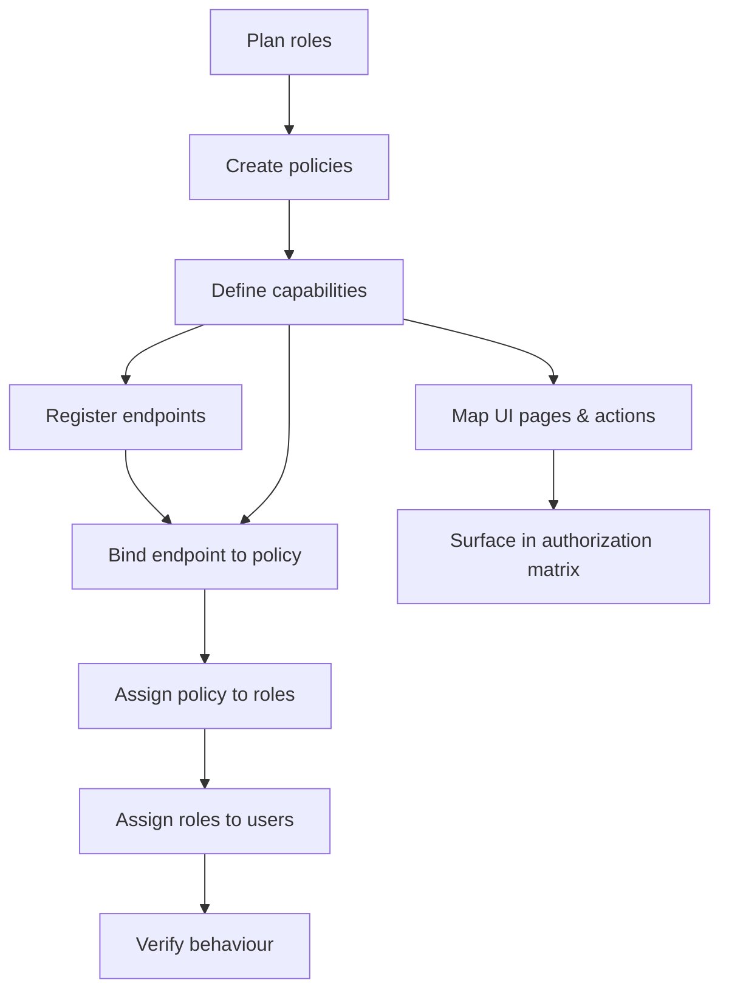

# RBAC Setup Playbook

**Navigation:** Previous: [Journey: Login To Data](../login-to-data.md) → Next: [VPD Setup Playbook](vpd.md)

Follow this sequence whenever you onboard a new tenant or extend permissions. Treat it like wiring a building’s security system—each step unlocks the next one.

## Overview Of The Flow



## 1. Plan Roles & Personas

- Confirm which personas exist (e.g., Worker, Employer, Board, Service Accounts).
- Decide whether new roles are needed or existing ones can be reused.
- Reference: `../../reference/role-catalog.md`.

## 2. Create Or Update Policies

Policies bundle capabilities and tie an endpoint to a set of roles.

**Via SQL:**
```sql
-- Insert a policy if it doesn't exist
INSERT INTO auth.policy (name, description)
VALUES ('EMPLOYER_POLICY', 'Employer actions for payment reconciliation')
ON CONFLICT (name) DO NOTHING;
```

**Via API (UI):**
```http
POST /api/admin/policies
Content-Type: application/json

{
  "name": "EMPLOYER_POLICY",
  "description": "Employer actions for payment reconciliation"
}
```

Link the policy to roles:

**Via SQL:**
```sql
INSERT INTO auth.role_policy (role_id, policy_id)
SELECT r.id, p.id
FROM auth.role r, auth.policy p
WHERE r.name IN ('EMPLOYER', 'TEST_USER')
  AND p.name = 'EMPLOYER_POLICY'
ON CONFLICT (role_id, policy_id) DO NOTHING;
```

**Via API (UI):**
```http
POST /api/admin/policies/{policyId}/roles
Content-Type: application/json

{
  "roleIds": [2, 3]
}
```
(where `roleIds` correspond to EMPLOYER and TEST_USER roles)

## 3. Define Capabilities

Use the `<domain>.<subject>.<action>` naming convention.

**Via SQL:**
```sql
INSERT INTO auth.capability (name, description)
VALUES ('payment.ledger.download', 'Download employer payment ledger CSV')
ON CONFLICT (name) DO NOTHING;
```

**Via API (UI):**
```http
POST /api/admin/capabilities
Content-Type: application/json

{
  "name": "payment.ledger.download",
  "description": "Download employer payment ledger CSV"
}
```

Map capabilities to the policy:

**Via SQL:**
```sql
INSERT INTO auth.policy_capability (policy_id, capability_id)
SELECT p.id, c.id
FROM auth.policy p, auth.capability c
WHERE p.name = 'EMPLOYER_POLICY'
  AND c.name = 'payment.ledger.download'
ON CONFLICT (policy_id, capability_id) DO NOTHING;
```

**Via API (UI):**
```http
POST /api/admin/policies/{policyId}/capabilities
Content-Type: application/json

{
  "capabilityIds": [12]
}
```
(where `capabilityIds` is the ID of the `payment.ledger.download` capability)

## 4. Register Endpoints

**Via SQL:**
```sql
INSERT INTO auth.endpoint (method, path, label)
VALUES ('GET', '/api/employer/payment-ledger', 'Download employer payment ledger')
ON CONFLICT (method, path) DO NOTHING;
```

**Via API (UI):**
```http
POST /api/admin/endpoints
Content-Type: application/json

{
  "method": "GET",
  "path": "/api/employer/payment-ledger",
  "label": "Download employer payment ledger"
}
```

Bind the endpoint to the policy:

**Via SQL:**
```sql
INSERT INTO auth.endpoint_policy (endpoint_id, policy_id)
SELECT e.id, p.id
FROM auth.endpoint e, auth.policy p
WHERE e.method = 'GET'
  AND e.path = '/api/employer/payment-ledger'
  AND p.name = 'EMPLOYER_POLICY'
ON CONFLICT (endpoint_id, policy_id) DO NOTHING;
```

**Via API (UI):**
```http
POST /api/admin/endpoints/{endpointId}/policies
Content-Type: application/json

{
  "policyIds": [5]
}
```
(where `endpointId` is the GET /api/employer/payment-ledger endpoint ID and `policyIds` contains EMPLOYER_POLICY ID)

## 5. Wire UI Pages & Actions

**Via SQL:**
```sql
-- Page visibility
INSERT INTO auth.ui_page (code, description)
VALUES ('EMPLOYER_DASHBOARD', 'Employer overview dashboard')
ON CONFLICT (code) DO NOTHING;

INSERT INTO auth.ui_page_capability (page_id, capability_id)
SELECT p.id, c.id
FROM auth.ui_page p, auth.capability c
WHERE p.code = 'EMPLOYER_DASHBOARD'
  AND c.name = 'payment.ledger.download'
ON CONFLICT (page_id, capability_id) DO NOTHING;

-- Button visibility
INSERT INTO auth.ui_action (code, description)
VALUES ('EMPLOYER_LEDGER_DOWNLOAD', 'Download ledger button')
ON CONFLICT (code) DO NOTHING;

INSERT INTO auth.ui_action_capability (action_id, capability_id)
SELECT a.id, c.id
FROM auth.ui_action a, auth.capability c
WHERE a.code = 'EMPLOYER_LEDGER_DOWNLOAD'
  AND c.name = 'payment.ledger.download'
ON CONFLICT (action_id, capability_id) DO NOTHING;
```

**Via API (UI):**
```http
-- Create UI page
POST /api/admin/ui-pages
Content-Type: application/json

{
  "code": "EMPLOYER_DASHBOARD",
  "description": "Employer overview dashboard"
}
```

```http
-- Link capability to page
POST /api/admin/ui-pages/{pageId}/capabilities
Content-Type: application/json

{
  "capabilityIds": [12]
}
```

```http
-- Create UI action
POST /api/admin/ui-actions
Content-Type: application/json

{
  "code": "EMPLOYER_LEDGER_DOWNLOAD",
  "description": "Download ledger button"
}
```

```http
-- Link capability to action
POST /api/admin/ui-actions/{actionId}/capabilities
Content-Type: application/json

{
  "capabilityIds": [12]
}
```

Front-end code should hide controls unless the capability appears in `/api/me/authorizations`.

## 6. Assign Roles To Users

**Via SQL:**
```sql
INSERT INTO auth.user_role (user_id, role_id)
SELECT u.id, r.id
FROM auth.user u, auth.role r
WHERE u.username = 'employer.demo'
  AND r.name = 'EMPLOYER'
ON CONFLICT (user_id, role_id) DO NOTHING;
```

**Via API (UI):**
```http
POST /api/admin/users/{userId}/roles
Content-Type: application/json

{
  "roleIds": [2]
}
```
(where `userId` is the ID of employer.demo user and `roleIds` contains EMPLOYER role ID)

If creating service accounts, ensure credentials are stored securely and tokens carry the correct audience.

## 7. Verify The Setup

1. Call `/api/me/authorizations` with the user’s JWT; confirm the new capability appears.
2. Invoke the guarded endpoint with both an allowed and disallowed user (expect 200 vs 403).
3. Run `SET ROLE app_payment_flow; SELECT auth.set_user_context(':userId');` followed by a data query to ensure RLS returns the correct rows.
4. Check audit logs for recorded access decisions.

## Troubleshooting Tips

- **Capability missing** – Recheck `auth.policy_capability` and `auth.role_policy`.
- **Endpoint still open** – Confirm controller annotation and `auth.endpoint_policy` entry.
- **Button still visible for others** – Verify UI uses the authorization matrix to gate rendering.

## Next Steps

Once RBAC is wired, continue to [VPD Setup Playbook](vpd.md) to configure tenant-level data guardrails.
